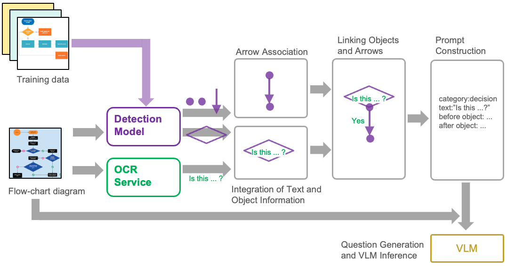

<div align="center">
  
</div>
<hr>

# Arrow-Guided VLM: Enhancing Flowchart Understanding via Arrow Direction Encoding

## 🔍 Project Overview



This repository contains the source code used for flowchart diagram detection in the research of [Arrow-Guided VLM: Enhancing Flowchart Understanding via Arrow Direction Encoding].

The project mainly consists of the following two components:

-   `notebooks/`: Contains Jupyter Notebooks used for experiments on deep learning models for flowchart diagram detection. Each notebook may have its own setup instructions and dependency lists (e.g., `requirements.txt` within the directory).
-   `src/`: Contains Python scripts for tasks related to Large Language Models (LLMs), such as parsers and evaluation tools.

## Environment Setup

### LLM-related Scripts (`src/`)

Python scripts in the `src/` directory use a standard Python virtual environment (`venv`).

**Prerequisites:**
-   Python 3.11 or later

**Setup Steps:**

1.  Move to the root directory of the project:
    ```bash
    cd gg-rq-rag-flowchat-detection
    ```

2.  Create a virtual environment:
    ```bash
    python -m venv .venv
    ```

3.  Activate the virtual environment:
    -   On macOS/Linux:
        ```bash
        source .venv/bin/activate
        ```
    -   On Windows:
        ```bash
        .venv\Scripts\activate
        ```

4.  Install dependencies for the `src` directory (if `src/requirements.txt` exists):
    ```bash
    pip install -r src/requirements.txt
    ```
    *(Note: Create this `requirements.txt` file as needed.)*

### Deep Learning Notebooks (`notebooks/`)

Follow the instructions in each Jupyter Notebook in the `notebooks/` directory to set up the required environment and dependencies for specific experiments. If a `notebooks/requirements.txt` file is provided, you can use `pip` within any environment (e.g., conda, venv) to install the dependencies.

## Development Tools

For the code in the `src/` directory, it is recommended to use `ruff` as a linter/formatter and `pytest` for testing. Install them within the `.venv` environment you created:

```bash
pip install ruff pytest
```

If you are using VSCode, installing the `charliermarsh.ruf` extension will enable automatic formatting and real-time lint checking when saving code.

## OCR, Detection -> LLM Execution Procedure

1. Place a directory named `images/` (or any appropriate name) in a suitable location and add the input images there.

2. At the same directory level, create a directory named `json/` and store the output results in COCO data format.

3. Create a `.env` file with the following environment variables, and place it inside the `gg-rq-rag-flowchat-detection/` directory:
```env
AZURE_OPENAI_ENDPOINT="https://..."
AZURE_OPENAI_API_KEY="..."
DEPLOY_NAME_GPT_4O="gpt-4o"
AZURE_DOCUMENT_INTELLIGENCE_ENDPOINT="https://..."
AZURE_DOCUMENT_INTELLIGENCE_KEY="..."
```

4. Execute `src/arrow-guided-vlm/graph` as a module using the command below:
```bash
cd gg-rq-rag-flowchat-detection/
python -m src.arrow-guided-vlm.graph --process_name image_all --img_dir PATH/TO/FLOW-CHART-IMAGE-DIRECTORY
# Example:
python -m src.arrow-guided-vlm.graph --process_name image_all --img_dir images/
```