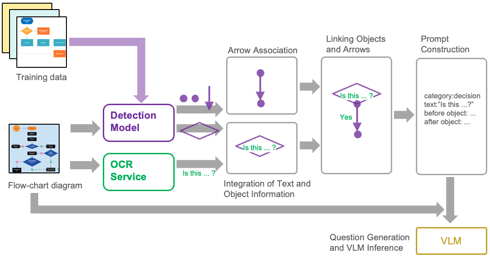

<div align="center">
  
</div>
<hr>

[](https://huggingface.co/datasets/galirage/FC-Detection)
[](https://opensource.org/licenses/Apache-2.0)
[](https://arxiv.org/html/2505.07864v1)
# Arrow-Guided VLM: Enhancing Flowchart Understanding via Arrow Direction Encoding

## 🔍 Project Overview



This repository contains the source code used for flowchart diagram detection in the research of [Arrow-Guided VLM: Enhancing Flowchart Understanding via Arrow Direction Encoding].

The project mainly consists of the following two components:

-   `notebooks/`: Contains Jupyter Notebooks used for experiments on deep learning models for flowchart diagram detection. Each notebook may have its own setup instructions and dependency lists (e.g., `requirements.txt` within the directory).
-   `src/`: Contains Python scripts for tasks related to Large Language Models (LLMs), such as parsers and evaluation tools.

## Environment Setup

### LLM-related Scripts (`src/`)

Python scripts in the `src/` directory use a standard Python virtual environment (`venv`).

**Prerequisites:**
-   Python 3.11 or later

**Setup Steps:**

1. **Install uv (if not already installed):**

    If you have not installed uv yet, please follow the instructions on the official website based on your operating system:

    👉 [https://github.com/astral-sh/uv](https://github.com/astral-sh/uv)

2. **Clone this repository and move to the project root:**

    ```bash
    git clone https://github.com/galirage/Arrow-Guided-VLM-Enhancing-Flowchart-Understanding-via-Arrow-Direction-Encoding.git
    cd Arrow-Guided-VLM-Enhancing-Flowchart-Understanding-via-Arrow-Direction-Encoding
    ```

3. **Create a virtual environment and install dependencies:**

    ```bash
    uv sync
    ```

4. **Activate the virtual environment:**

    ```bash
    source .venv/bin/activate
    ```

### Deep Learning Notebooks (`notebook/`)

Follow the description in `notebook/G_detect_flowchart_yoloDamo.ipynb` to set up, train, and test.

## OCR, Detection -> LLM Execution Procedure

1. Place a directory named `images/` (or any appropriate name) in a suitable location and add the input images there.

2. At the same directory level, create a directory named `json/` and store the output results in COCO data format.

3. Create a `.env` file by copying and editing the provided `.env.example` file.  
   Place the resulting `.env` file in the `Arrow-Guided-VLM-Enhancing-Flowchart-Understanding-via-Arrow-Direction-Encoding` directory.

   Example:

   ```bash
   cp .env.example .env
   ```

   Then edit .env to set your actual credentials

4. Execute `src/arrow-guided-vlm/graph` as a module using the command below:

   ```bash
   cd Arrow-Guided-VLM-Enhancing-Flowchart-Understanding-via-Arrow-Direction-Encoding/
   uv run python -m src.arrow-guided-vlm.graph --process_name all_image --img_dir PATH/TO/FLOW-CHART-IMAGE-DIRECTORY --output_dir PATH/TO/OUTPUT/DIR
   ```

   Example:

   ```bash
   uv run python -m src.arrow-guided-vlm.graph --process_name all_image --img_dir images/ --output_dir output
   ```

## dataset

The dataset used in this research is available on [Hugging Face Datasets](https://huggingface.co/datasets/galirage/FC-Detection).

### detection dataset

The `notebook/detection_data/` directory contains data for training and testing the detection model in the form of coco data. Among them, `notebook/detection_data/train/` is the data used for training and evaluation, and `notebook/detection_data/test/` is the test data used to test the training model.

For more information, please see `notebook/G_detect_flowchart_yoloDamo.ipynb`

### pipeline dataset

The images in the `images/` directory are samples of the data used in the pipeline. The corresponding inference results of the detection model are stored in the `json/` directory.

## 📝  License

This project is released under the Apache 2.0 license.

## Author

[Galirage Inc.](https://galirage.com)